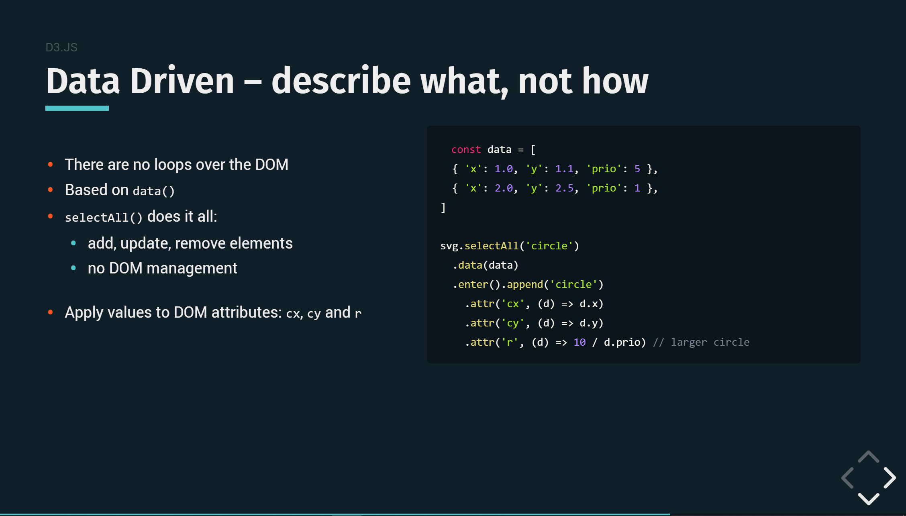

# tidy-revealjs

A custom theme and build system for reveal.js

I love [reveal.js](https://github.com/hakimel/reveal.js) for its ability to let me do slide with code directly in the browser and with [markdown](https://github.com/hakimel/reveal.js/#markdown). Theming and slide management is however tricky. Moving slides means navigating yourself in a potentially large and nested DOM tree.

What if instead you just wrote markdown and the slides were automatically generated for you?

### Preview

This [WorkerConf slide](https://github.com/julie-ng/workerconf-slides) was created using just markdown:




## Slides via File Structure  

When it comes to content, there is no `index.html` with slides. Instead, you create files inside the `slides` folder, which are loaded in alphabetical order.

### How to re-order slides

- slide order is determined by alphabetical order
- subfolders are interpreted as [vertical slides](https://github.com/hakimel/reveal.js/#vertical-slide-navigation)

Here is an example file structure for `slides/`

```
./slides
├── 1.html
├── 2.md
├── 3.md
└── base
    ├── bulleted-lists.md
    ├── ordered-lists.md
    ├── tables-as-html.html
    └── tables.md
```

The easiest way to manage order of your slides is to **prepend the filenames with numbers**, for example:

```
├── 1-title.html
├── 2.md
├── 3-point-of-view.md
├── 4-markdown-support.html
```

## Slide Types: HTML vs Markdown

- **HTML Slides** must have `<section>` as root element.
- **Markdown Slides** have the `.md` extension.

